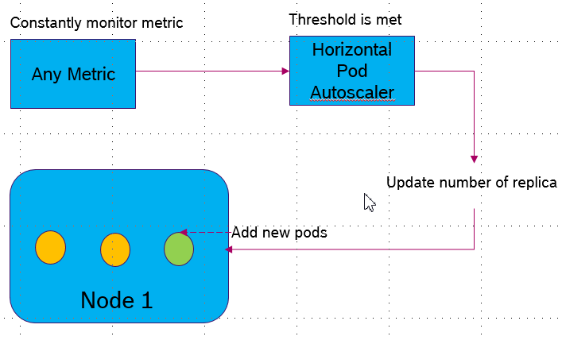
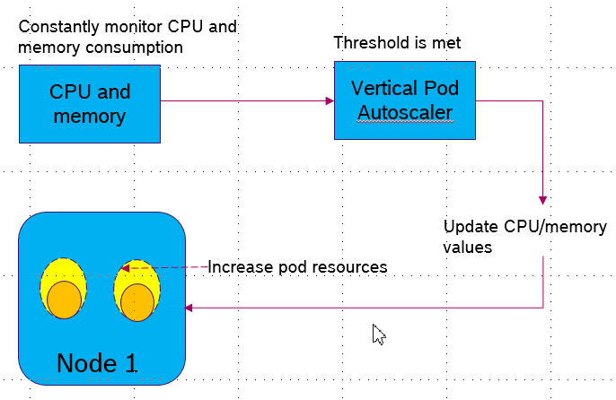
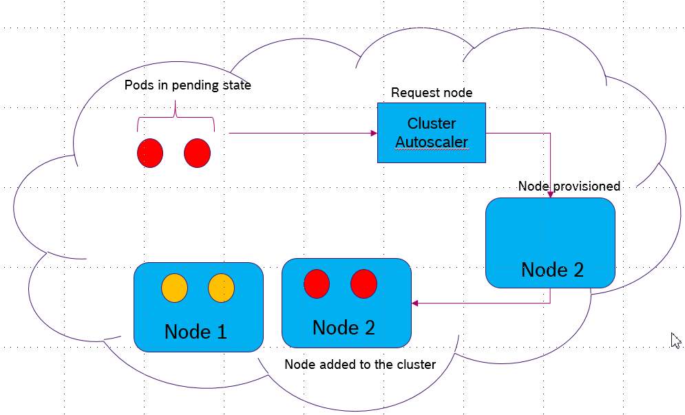

## Kubernetes Autoscaling Building Blocks 

- Scaling of applications is one of the main features of Kubernetes. Where Kubernetes cluster is capable of  increasing or decreasing the resources when the demand for service response increases or decreases. 

Lets consider Amazon as an example, everyday there will be an average number of users visiting their site so Kubernetes runs few instances of application to manage the load. However, during the sale or festive season the demand to access Amazon increases manifold. To cope up with such increase in demand, Kubernetes autoscales the number of pods or nodes on cloud and when the demand is decreased, the extra resources are released back to the cloud.

What to scale: In Kubernetes, you can either scale pods or nodes. Pods can be scaled if the node has enough resources to schedule and execute pods otherwise, we need to add more nodes to support the extra workload.

When to scale: You would want to scale when certain metric crosses the threshold value. For example, trigger a scale operation when the CPU usage crosses 80%.

How to Scale: 
-Pod layer autoscaler
	Horizontal Pod Autoscaler (HPA)
	Vertical Pods Autoscaler (VPA)
-Cluster Autoscaler (CA)

### Horizontal Pod Autoscaler (HPA):
The Horizontal Pod Autoscaler (HPA) scales the number of pods available in a cluster in response to custom metrics reported from within Kubernetes or external metrics from sources outside of your cluster. Once you have set up HPA, it will continuously monitor the metrics every 30 secs. As soon as the threshold is met, it increases or decreases the number of pod replicas in the deployment controller. This triggers the deployment controller to scale the pods up or down. HPA can be customized to wait for a definite time internal between two scaling operations: default is 5 minutes

### Vertical Pod Autoscaler (HPA):
Vertical Pod autoscaler scales the Pod resources CPU/memory. VPA constantly monitors the pod resources to see if the limits have been reached and allocates more or less resources to the Pod on load basis. This type of scaling is best suited for stateful pods where horizontal scaling is not possible. This way all the existing pods would consume resources from node to the best possible extent.
VPA is adapted at three different levels.
	1. To just use as a recommender and change the resource limits manually from time to time
	2. Allow VPA to only allocate resource to newly created pods based on the estimate
	3. Allow VPA to change the running pods resource by recreating them (this will honor Pod Disruption Budget, if set)

Note: we cannot use HPA and VPA together. However, any HPA or VPA cn be used together with Cluster Autoscaler

### Cluster Autoscaler (CA):
When enabled, Cluster autoscaler looks for the pods that cannot be scheduled and checks if adding a new node, similar to the other in the cluster, would help. If yes, then it resizes the cluster to accommodate the waiting pods. It also scales down the cluster whenever the utilization of a node falls below a certain threshold defined by the cluster administrator. Cluster autoscaler makes sure that all pods have place to run regardless of the CPU usage. The procedure to set up cluster auto scaling is slightly different for every cloud provider.
For GCE or GKE, you can follow instructions from cluster autoscaling section
https://kubernetes.io/docs/tasks/administer-cluster/cluster-management/

